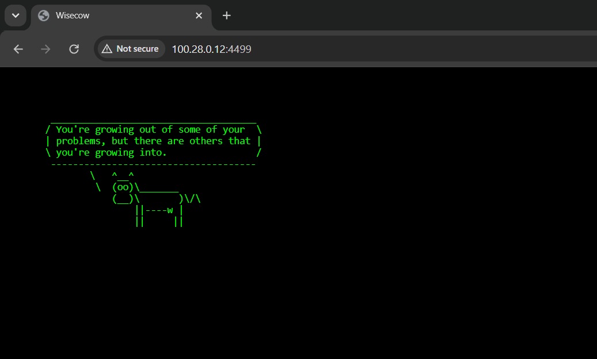

# Cow wisdom web server

## Prerequisites

```
sudo apt install fortune-mod cowsay -y
```

## How to use?

1. Run `./wisecow.sh`
2. Point the browser to server port (default 4499)

## What to expect?

## Output
Successfully Deployed application on K8S
